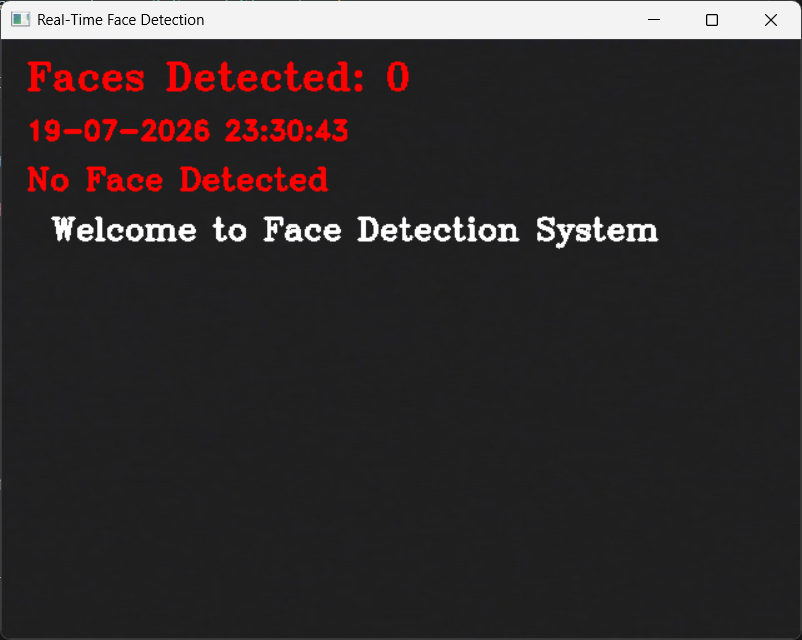
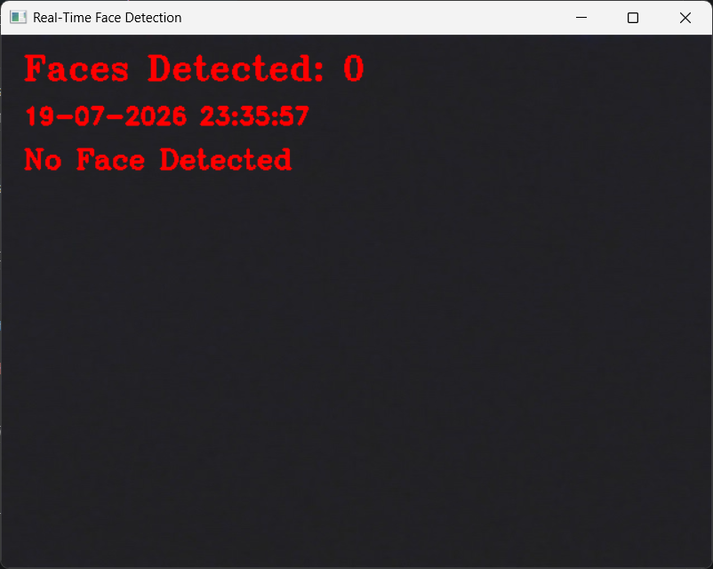

# Real-Time Face Detection System using OpenCV

## Project Overview
This project is a real-time face detection system developed using Python and OpenCV. It captures live video from the webcam and detects human faces using the Haar Cascade Classifier. The application continuously analyzes each video frame, identifies faces, and provides visual feedback through an interactive interface.

The project was enhanced with several user-friendly features to improve the overall experience, including live face counting, real-time date and time display, automatic image saving with timestamps, startup messages, and customized face annotations.

---

## Key Features

### Real-Time Face Detection
The system continuously captures frames from the webcam and detects faces instantly using OpenCV's Haar Cascade Classifier.

### Corner-Style Face Bounding Box
Instead of drawing a traditional rectangle, the system displays stylish corner markers around each detected face, creating a cleaner and more professional appearance.

### Face Labeling
Each detected face is labeled with **"Detected Face"** above the bounding box for better visualization.

### Live Face Counter
The application continuously counts the number of detected faces and displays the result in real time.

Example:

```
Faces Detected: 2
```

### Real-Time Date and Time
The current date and time are displayed while the application is running, updating every frame.

Example:

```
19-07-2026 22:45:18
```

### Welcome Screen
When the application starts, a welcome message is displayed for a few seconds before disappearing automatically.




### No Face Warning
If no face is detected, the system displays a clear warning message.




### Image Capture
Users can capture the current webcam frame at any time by pressing the **S** key.

### Automatic Timestamped Image Saving
Captured images are automatically saved using the current date and time as the filename to prevent overwriting previous images.

Example:

```
Face_20260719_224530.jpg
```

### Keyboard Controls

- **S** → Save current image.
- **Q** → Exit the application.

---

## Technologies Used

- Python
- OpenCV
- NumPy
- Jupyter Notebook
- Visual Studio Code
- Anaconda

---

## Project Structure

| File | Description |
|------|-------------|
| [Face_Detection.ipynb](Face_Detection.ipynb) | Main notebook containing the complete face detection implementation. |
| [Screenshot.png](Screenshot.png) | Screenshot demonstrating the application's output. |
| [README.md](README.md) | Project documentation, setup instructions, and feature overview. |

---

## How It Works

1. The webcam captures live video frames.
2. Each frame is converted to grayscale.
3. The Haar Cascade Classifier detects human faces.
4. Corner-style markers are drawn around each detected face.
5. The application labels detected faces.
6. The total number of detected faces is updated continuously.
7. The current date and time are displayed in real time.
8. A welcome message is shown when the program starts.
9. A warning message appears when no face is detected.
10. Users can save images with automatically generated timestamped filenames.

---

## Output

The application interface displays:

- Live webcam feed.
- Corner-style face detection.
- Face labels.
- Number of detected faces.
- Real-time date and time.
- Welcome message during startup.
- No-face warning.
- Automatic image saving.


---

## Future Improvements

- Face recognition.
- Smile detection.
- Eye detection.
- Emotion recognition.
- Deep learning-based face detection.
- Video recording functionality.
